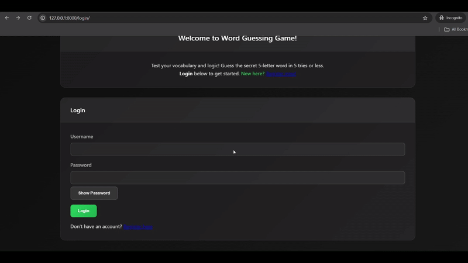
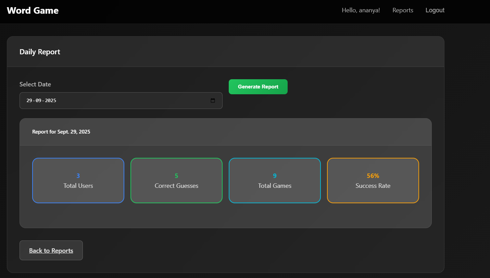
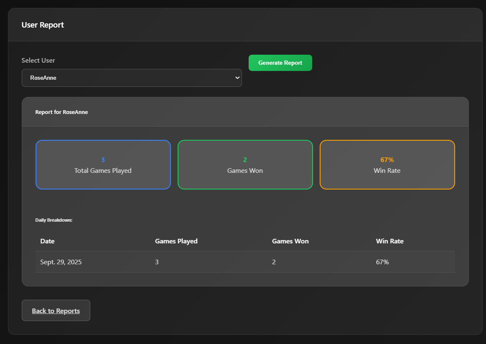

<p align="center">
   
</p>

A Django-based word guessing game similar to Wordle, featuring user authentication, game statistics, and admin reporting capabilities.

## Features

### 🪼 Core Game Functionality
- **5-letter word guessing game** with Wordle-like mechanics
- **Color-coded feedback** for guesses: correct position (green), wrong position (yellow), not in word (gray)
- **Daily game limit** of 3 games per user
- **Streak tracking** and point system based on wins
- **Word validation** using NLTK corpus or pandas dataset for English word verification

### 🪼 User Management
- **Custom user registration** with enhanced validation requirements
- **Username requirements**: minimum 5 characters with both upper and lowercase letters
- **Password requirements**: minimum 5 characters with alphabetic, numeric, and special characters
- **Secure authentication** with Django's built-in auth system

### 🪼 Admin Dashboard & Reporting
- **Daily reports**: View user activity and success rates for specific dates
- **User reports**: Detailed statistics for individual users including daily breakdowns
- **Game session tracking** with comprehensive statistics

### 🪼 Modern UI/UX
- **Dark theme** with gradient backgrounds and glassmorphism design
- **Responsive design** that works on desktop and mobile devices
- **Interactive game grid** with smooth animations and hover effects
- **Real-time feedback** and user-friendly error messages

## Technology Stack

### 🪼 Backend
- **Django 5.2.6** - Web framework
- **SQLite** - Database for development
- **NLTK 3.9.1** - Natural Language Toolkit for word validation (optional)
- **pandas 2.3.2** - Data manipulation for word processing (optional)

### 🪼 Frontend
- **HTML5** with Django templates
- **Custom CSS** with modern design patterns
- **JavaScript** for interactive features
- **Bootstrap-inspired** responsive grid system

## Installation & Setup

### 🪼 Prerequisites
- Python 3.8+
- pip package manager

### Setup Instructions

1. **Clone the repository**
   ```bash
   git clone <repository-url>
   cd wordgame
   ```

2. **Create virtual environment**
   ```bash
   python -m venv venv
   source venv/bin/activate  # On Windows: venv\Scripts\activate
   ```

3. **Install dependencies**
   ```bash
   pip install -r requirements.txt
   ```

4. **Setup database**
   ```bash
   python manage.py makemigrations
   python manage.py migrate
   ```

5. **Create superuser**
   ```bash
   python manage.py createsuperuser
   ```

6. **Add words to database**
   ```bash
   python manage.py shell
   # Import and add Word objects to the database
   ```

7. **Run development server**
   ```bash
   python manage.py runserver
   ```

## Project Structure

```
wordgame/
├── manage.py                 # Django management script
├── requirements.txt          # Python dependencies
├── wordgame/                # Main project directory
│   ├── settings.py          # Django settings
│   ├── urls.py              # URL configuration
│   ├── wsgi.py              # WSGI configuration
│   └── asgi.py              # ASGI configuration
└── game/                    # Game application
    ├── models.py            # Database models
    ├── views.py             # View functions
    ├── forms.py             # Form definitions
    ├── urls.py              # App URL patterns
    ├── admin.py             # Admin interface
    ├── apps.py              # App configuration
    └── templates/           # HTML templates
        ├── game/
        │   ├── base.html        # Base template
        │   ├── game.html        # Game interface
        │   ├── reports.html     # Admin reports menu
        │   ├── daily_report.html # Daily statistics
        │   └── user_report.html  # User statistics
        └── registration/
            ├── register.html    # User registration
            └── login.html       # User login

```

## Database Models

### 🪼 Word Model
- Stores 5-letter words for the game
- Unique constraint ensures no duplicate words

### 🪼 GameSession Model
- Tracks individual game sessions
- Links users to words with completion status
- Stores win/loss state and number of guesses used

### Guess Model
- Records each guess made during a game
- Provides letter status feedback (correct/wrong position/not in word)
- Maintains guess order and timestamps

## Usage

### 🪼 Playing the Game
1. Register an account or log in
2. Navigate to the main game page
3. Enter 5-letter word guesses
4. Use color feedback to guide subsequent guesses
5. Win by guessing the correct word in 5 attempts or fewer

### 🪼 Admin Features
1. Access admin panel at `/admin/`
2. Add words to the game database
3. View game sessions and user statistics
4. Generate daily and user-specific reports

## Security Features
- CSRF protection on all forms
- User input validation and sanitization
- Secure password requirements
- Admin-only access to reporting features

## Development Notes
- Game implements Wordle-style mechanics with custom enhancements
- Word validation ensures only valid English words are accepted
- Daily limits prevent excessive gameplay
- Responsive design works across all device sizes

## 🪼 **Website Demo Preview**



## 🪼 **Daily Reoprt Demo**


## 🪼 **Individual user Reoprt Demo**


This project demonstrates modern Django development practices with a focus on user experience, security, and maintainable code architecture.
